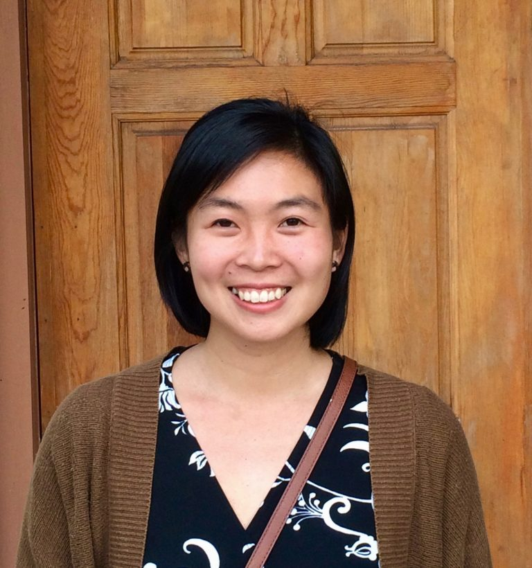
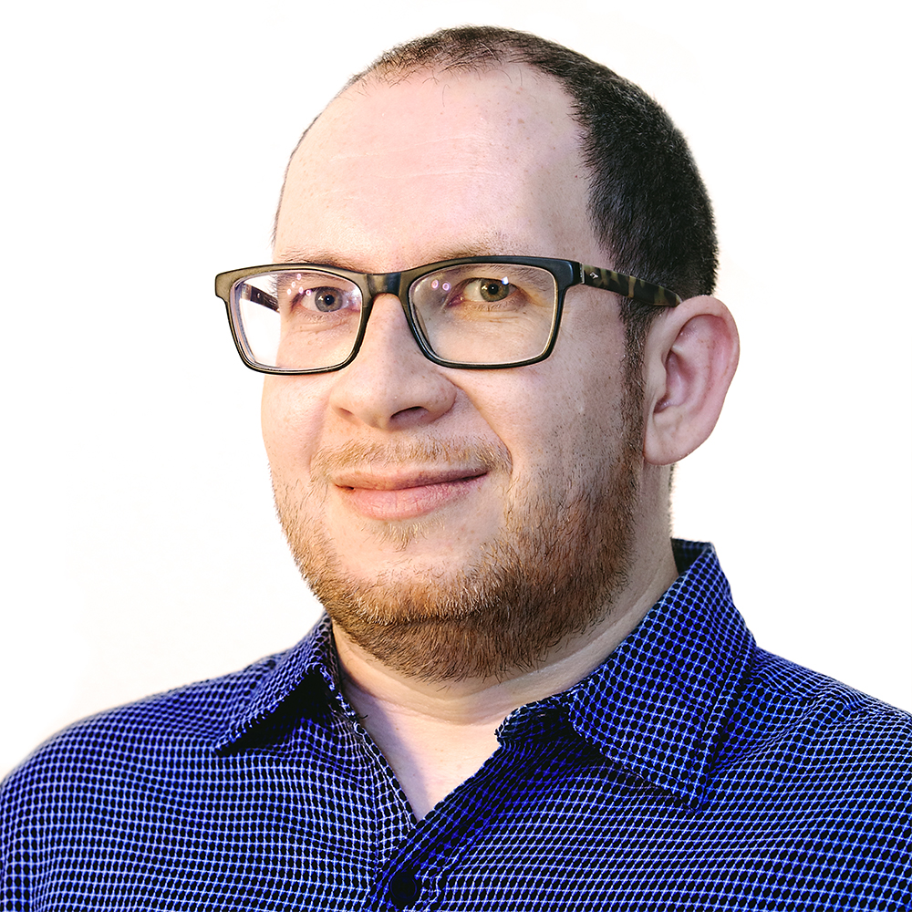

```{r xaringan-themer, include = FALSE}
# setup
library("here")
source(here("R/setup-lectures.R"))
```

class: inverse, center, middle

# Math and Political Science

### (Political Science and Math)


---
class: center, inverse, middle

# Why math?


---

class: center

# In general...

--

Math is explicit and specific

--

*Formalizing:* lay out premises and assumptions, derive implications

--

Discover hidden insights

--

Even if you don't do highly mathematical work, you will encounter it


---

class: center

# For empirical research <br> (data analysis...)

--

Principled measurement methods

--

Formally describe patterns in observed data

--

Make judgments about *statistically meaningful* findings (vs. random noise)

--

Make causal inferences


---

class: center

# For formal models <br> (game theory...)

--

Define sets of actors, preferences, incentives

--

Derive actors' strategies for optimal payoffs

--

Describe trade-offs of certain actions

--

Dealing with limited information, probabilistic beliefs, learning from new information


---

class: inverse, center, middle

# Objectives


---

# Objectives

Operationally...
--

- Preparation for methods courses
- Practicing essential arithmetic routines

--

Conceptually...
--

- Show where political science needs math (using examples)
- Intuitive, conceptual understanding is most important

--

You won't memorize everything we cover this week,

but you need to be able to "roll with it" in class


---

class: center, middle, inverse

# Reassurances


---

# Reassurances


Some material will be unfamiliar (and maybe scary) at first, *but*...

--

- Nobody expects you to be an expert by the end of math camp (that isn't the point)

--

- The point is intuition and application, not proofs or overly tricky examples

--


How do we know you will be fine?

--

- Different areas of research emphasize different areas of math (and specialization is the norm)

--

- You get out what you put in


---

class: center, middle

# Questions so far?


---

class: center, middle, inverse

# Agenda


---

### Mornings (9–12ish): math lessons

Lecture slides, definitions, examples

--

### Afternoons: practice

Take-home exercises will be distributed

--


#### Contact your instructors at any time

Feel free to contact us through Slack or via email and we will be responding to questions until 9PM

(But you should feel free to ask questions throughout)


---


#### Monday: Essential algebra and pre-calculus (Marcy)

- Fundamentals, notation, functions

--

#### Tuesday: Linear algebra, Intro to R (Marcy)

- Vectors and matrices
- Useful for manipulating real data
- How to use basic commands in R

--

#### Wednesday: Calculus (Anton)

- Limits, derivatives, integrals
- How variables affect other variables

--

#### Thursday: Finish calculus (Anton), Quiz

- Quiz to get a sense of how comfortable you are with math

--

#### Friday: Probability (Anton), Methods Q&A

- Mathematical intuitions of independent and conditional probability
- Probabilistic processes (random variables), patterns in "real data"


---

class: center, middle

# Deliverables?

Daily exercises (not collected)

No final exam (or grades of any kind)

You are in charge of yourselves

### Questions?


---

# In the classroom

--

- Covering lots of ground

--

- Everyone has a different background

--

- Please ask questions

--

- Open and accepting environment

--

### Let us (Anton and me) know how we can make this work better

--
- Ask lots of questions! They help the entire class!

- Slow us down

- Ask *why* we are learning something


---

# Resources

The [Github repository]( https://github.com/marcyshieh/math-camp-2021):

- Slides, exercises
- Source code to build it all

Other resources:

- Gill, [*Essential Mathematics for Political and Social Research*](https://www.amazon.com/Essential-Mathematics-Political-Research-Analytical/dp/052168403X)
- Moore & Siegal: [*A Mathematics Course for Political & Social Research*](http://people.duke.edu/~das76/MooSieBook.html)


---

class: center, middle, inverse

# About your instructors


---

# Marcy Shieh

.pull-left[]

.pull-right[
Originally from California (SF Bay Area)

Studies American politics & political methodology (since 2017)

Judicial politics, campaign rhetoric, institutions

Methological focus: text analysis and experiments

Email: [mshieh2@wisc.edu](mailto:mshieh2@wisc.edu)]


---

# Anton Shirikov

.pull-left[]

.pull-right[
Originally from Russia. Switched back and forth between journalism and academia, but finally settled on the latter

Studies comparative politics & political methodology (since 2015)

Authoritarian politics, media, propaganda, legacies of communism

Methodological focus: experiments

Email: [shirikov@wisc.edu](mailto:shirikov@wisc.edu)]

---
class: center, middle, inverse

# Acknowledgements

We thank Sarah Bouchat, Michael DeCrescenzo, Micah Dillard, Brad Jones, and Dave Ohls for sharing previous Math Camps' materials.


---

class: center, middle, inverse

# Let's get started

```{css, echo=FALSE}
@media print {
  .has-continuation {
    display: block;
  }
}
```
