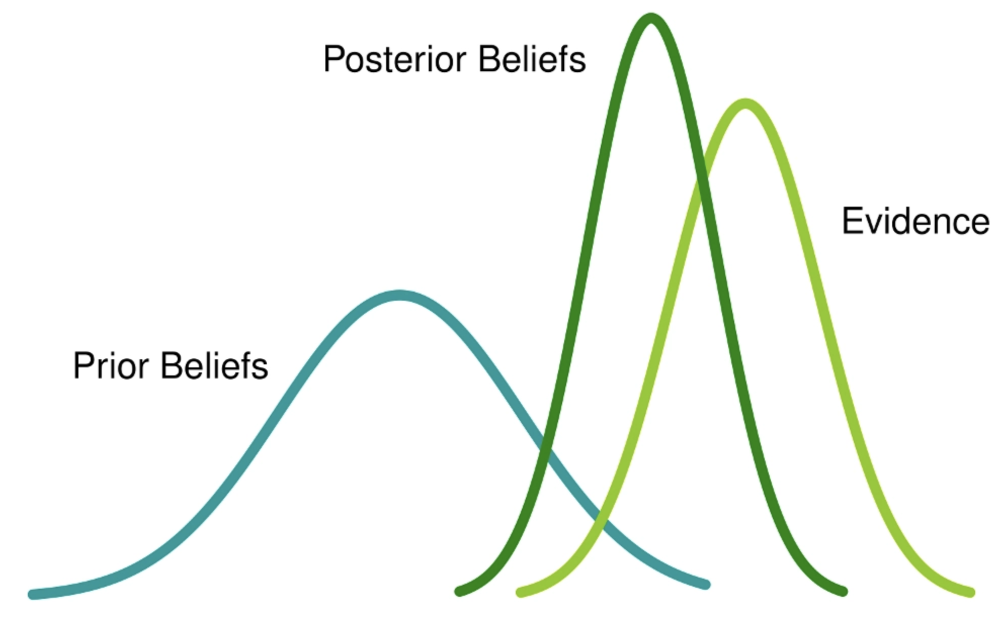

```{r setup, include = FALSE}
library("here")
source(here("R/setup-lectures.R"))
```

### Hang in there

<center>

</center>


---

## Agenda

- Why do we need statistics?

- Counting

- Set theory

- Probability

- Independence, joint probability

- Bayes' Theorem

- Looking ahead

---

## Why statistics?

Imagine we want to understand under what conditions democracies fail. Lots of factors may lead to such failures, and we want to learn which of these factors are more important. How do we do that?

--

- We build a model that includes a number of variables (e.g., economy, conflict, etc.)

- In the model, we have parameters associated with these factors that tell us about their influence 

- Statistics allows us:
  + to estimate these parameters, to learn which factors are systematically related to our outcome of interest
  + to estimate how (un)certain we should be in our estimates


---

## What statistics is

The mathematical study of data

--

- Data come from some underlying, unknown process (e.g., poor economy makes citizens more sympathetic to authoritarian leaders)

--

- **Descriptive statistics:** describe the data (how often democracies fail, in what time periods they failed more)

--

- **Inferential statistics:** describe the underlying process, argue about causality, test theories (is it about the economy? about conflict? etc.)

--

In political science, we do both, but a lot of emphasis is on inference and causality

---

## Statistics and probability

To make inferences about the **data generating process**, we use probability

--

- We have some data: regime failures, GDP statistics, conflict occurrence, etc. 

- But we don't know which process regime failures come from (e.g., do democracies fail because of poor economy, or because of violent conflict, or both?)

--

- We entertain different **models** for the process and pick the best model based on the probability of data under each model

--

- Probability also helps us evaluate the level of uncertainty around our findings


---

## Helpful vocabulary

A **random variable** is a realization of a process that is at least partially random (i.e. unpredictable)

- e.g. coin flip, dice roll, regime failure (or absence of failure)  
- probability enters statistics through the assumptions we make about the nature of randomness in a random variable (e.g., whether certain kinds of outcomes are more likely than others)

--

A random variable could have a number of different **potential outcomes** (e.g., heads or tails, democratic survival or failure, the number of deaths in a conflict)

--

The probability of all potential outcomes is described with a **probability distribution**, a *function* that maps each potential outcome to a certain probability
- $x$ = potential outcome
- $f(x)$ = probability of $x$

These also matter for formal (non-statistical) models (e.g., an actor learns certain information with some probability)


---

## Common probability distributions

<center>

</center>

---

## How probability distributions work

Probability distributions can describe discrete outcomes (regime survival or failure) or continuous outcomes (election turnout, vote margin)

--

Probability distributions always sum to 1

- "The law of total probability" (allows to calculate probabilities of certain events based on probabilities of other events)
- Discrete distributions: sum the probabilities of all potential outcomes
- Continuous distributions: integrate over the continuous space of outcomes

--

Probability distributions are the basis for statistical inference

- $z$-scores, $p$-values
- Prior and posterior beliefs


---

class: inverse, middle, center

## Counting


---

## Counting

First, what is probability?

--

- The ratio of an event's *expected frequency* to the number of possible events
--

- We need to count the events in question & total possible outcomes

--

Suppose an **event** is described by $K$ different component parts. (E.g., we roll a die $K$ many times.) Each component $k = \{1, 2, \ldots, K\}$ has $n_{k}$ possible values. What is the number of distinct outcomes we could get?

--

$$\prod\limits_{k = 1}^{K} n_{k}$$

(multiply the $n_{k}$'s)


--

I roll a 6-sided die 4 times. How many unique sets of 4 rolls can I obtain (assuming that different orderings of the same 4 numbers are different events)?


---

## Complex counting considerations

Does the *order of selection* matter? (Is $\{1, 2\} = \{2, 1\}$?)

Are selected objects *replaced* (able to be selected again) or *not replaced*?

(You might hear the terms "combination" and "permutation". Usually, "permutation" refers to situations where order matters, and "combination" refers to situations where order does not matter.)


---

## Ordered, with replacement

This is easiest because (a) no need to adjust for "double-counting" and (b) the number of possibilities is always constant.

The number of possible ways to select $k$ elements from a larger pool of $n$ is

$$n \times n \times n \times \ldots \times n = n^{k}$$

Intuition: in each draw, there are $n$ possibilities. Each of $n$ outcomes in one draw can be combined with the $n$ outcomes in any (and all) other draws.

Examples: rolling two dice several times, PIN codes, phone numbers


---

## Ordered, without replacement

The number of ways to select $k$ objects from a pool of $n$ possible objects, where order matters, but replacement does not occur.

$$\begin{align}
  n * (n - 1) * (n - 2) * \ldots * (n - k + 1) = \frac{n!}{(n - k)!}
\end{align}$$

Intuition: each draw *removes an object* from the larger pool. Subsequent draws have one less element to choose from.

Example: winning lottery numbers, ranking of candidates in an election 


---

## Unordered, without replacement

The number of ways to select $k$ objects from a pool of $n$ possible objects, where order does not matter and replacement does not occur.

Intuition: we have fewer possibilities than before. Substantively identical elements ( $A$ and then $B$; $B$ and then $A$) are not double counted

$$\begin{align}
  \frac{n!}{k!(n - k)!} &= {\binom{n}{k}}
\end{align}$$

For example: survey samples, raffles, possible groups of 2 in a classroom


---

## Unordered, with replacement

The number of possible ways to select $k$ elements from a larger pool of $n$ possible elements, where order does not matter and replacement does occur

$$\frac{(n + k - 1)!}{(n-1)!k!} = \binom{n + k - 1}{k}$$

Examples: the number of heads if you flip a coin $n$ times


---

## Exercises

Imagine we rank the 3 top swimmers among us.

- Is this a situation where order matters?
--

- Is this a situation with replacement, or no replacement?
--

- How many different possible rankings could there be?

--

Imagine we have 4 different scholarships for students in this class. You can win more than one scholarship. How many different sets of winners can there be?

--

Imagine we have 5 identical candies for students in this class. You can win more than 1 candy. How many different sets of winners can there be?

--

Imagine we have 2 identical bicycles for students in this class. You can only win 1 bicycle. How many sets of winners?


---

class: center, middle, inverse

## Set Theory


---

## Sets

Remember: a **set** is a collection of elements. Could be numbers, units, areas in space...

.pull-left[
- $F = \{1, 2, 3, 4\}$
- $G = \{1, 3, 5\}$
- $H = [0, 1] \cup (2, 3)$

What are unions? 

Intersections? 

Disjoints? 

Subsets? 

Supersets?
]

.pull-right[

]


---


## The sample space

The **sample space** (denoted $S$ or $\Omega$) is the set that contains all the elements in question.

Sometimes called the *universal set*.

"Universal" does not mean that it contains *everything*. Rather, it's all the relevant objects: e.g., the universal set for a nationally representative survey sample is a country's population (not all the people in the world).


---

## Complementary sets

The **complement** of set $A$ (denoted as $A^{C}$) is the set of all elements in the sample space that are *not contained* in $A$

$$A^{C} \equiv X \text{ such that } X \notin A$$

--

Example, $\Omega = [0, 1]$

- If $X = (0, 0.5]$, what is $X^{C}$?
--

- $X^{C} = \{0\} \cup (0.5, 1]$

--

What is $\Omega^{C}$?

--

- $\emptyset$


---

class: inverse, middle, center

## Probability


---

## Sets and probability

We can use sets to represent the probability of events. Total area represents the total probability of all events (equal to $1$).

<center>
  
</center>

--

$A$ is an event, and its area is a subset of the total area.

--

.pull-left[
$\mathrm{Pr}(A)$?
]

.pull-right[
$\mathrm{Pr}(A^{C})$?
]


---

## Let's play cards

There are 4 suits (hearts, diamonds, spades, clubs) and 13 card values (Ace, 2, 3, ..., Jack, Queen, King). Suits and values can both be sets.

<center>

</center>

--

Total area = 1

Probability of an individual card: $\frac{1}{52}$


---

## Properties of probabilities

Probabilities are strictly bounded on the closed interval $[0, 1]$

- $p(A) \in [0, 1]$
--

- $A$ is either impossible ( $p = 0$), certain ( $p = 1$), or in between (possible, $p \in (0, 1)$)

--

If we have $N$ many *collectively exhaustive* and *mutually exclusive* sets of potential outcomes, their probabilities sum to 1. Which is to say, *something must happen*.

$$\sum\limits_{n = 1}^{N} p(A_{n}) = 1$$


---

## Probability of complements

If $\Omega$ contains the set of all potential outcomes, and $A$ is an event that is a subset of the outcome space that occurs with $p(A)$...

What is $p(A^{C})$?

--

$p(A^{C}) = 1 - p(A)$

--

The intuition: *Something* must happen, either $A$ or not $A$


---

## Example of complements

Probability that a random card is a Heart? $p(H) = \frac{1}{4}$
<center>

</center>

--


Probability that a card is not a Heart? $1 - p(H) = \frac{3}{4}$


---

## Probability of unions

.pull-left[
The probability of $A \cup B$

The probability that *either* $A$ or $B$ occurs


]

.pull-right[
<center>
  
</center>
]

--

$p(A \cup B) = p(A) + p(B) - p(A \cap B)$

The intuition: the sum of $A$ and $B$ will double count $A \cap B$, so we need to subtract one instance of $A \cap B$


---

## Probability of unions

What is the probability that we draw a card that is *either* a Heart *or* a face card?

<center>
  
</center>

--

$p(H) = ?$

--

$p(F) = ?$

--

$p(H \cap F) = ?$

--

$p(H \cup F) = \frac{1}{4} + \frac{12}{52} - \frac{3}{52} = \frac{22}{52}$


---

## Probability of intersections

.pull-left[
The probability of $A \cap B$

The probability that *both* $A$ and $B$ occur
]

.pull-right[
<center>
  
</center>
]

--

$$p(A \cap B) = p(A) + p(B) - p(A \cup B)$$

The intuition: we care only about the component that we double counted


---

## Probability of intersections

What is the probability that we draw a card that is *both* a Heart *and* a face card?

<center>
  
</center>

--

$p(H) = ?$

--

$p(F) = ?$

--

$p(H \cup F) = ?$

--

$p(H \cap F) = \frac{1}{4} + \frac{12}{52} - \frac{22}{52} = \frac{3}{52}$


---

## Conditional probability

The probability of $A$, given $B$, is expressed as $p(A \mid B)$

.pull-left[

What is the probability of $A$, given that $B$ also occurs?

]

.pull-right[
<center>
  
</center>
]

--

$$p(A \mid B) = \frac{p(A \cap B)}{p(B)}$$

The intuition:

- If we *know* that $B$ happened, we only care about the space within $B$

- The probability that both $A$ and $B$ happen, divided by the probability of $B$

- $p(\mathrm{intersection}) \; / \; p(\text{conditioning event})$


---

## Conditional probability

<center>
  
</center>

--

What is the probability of drawing the Ace of Diamonds?

--

What is the probability of drawing the Ace of Diamonds, *given that* we have have drawn an Ace?

--

- $p(\text{Ace of Diamonds}) = \frac{1}{52}$
--

- $p(\mathrm{Ace}) = \frac{4}{52}$
--

- $p(\text{Ace of Diamonds} \mid \mathrm{Ace}) = \frac{{1/52}}{{4/52}} = \frac{1}{4}$

---

## Conditional probability in political science

Many questions we ask in political science are about conditional probabilities. For example:

- What is the probability that [an authoritarian government increases welfare spending](https://journals.sagepub.com/doi/10.1177/0010414014555443?icid=int.sj-full-text.similar-articles.1), given that it performs poorly in an election?

- How likely is [a police officer to shoot a minority civilian](https://twitter.com/jonmummolo/status/1157056403137318913), given that the officer is white/non-white?

- What is the probability that [a respondent expresses positive feelings toward immigrants](https://www.cambridge.org/core/journals/american-political-science-review/article/family-matters-how-immigrant-histories-can-promote-inclusion/871DB7A02565D65FB0584FE89D7EF35D) conditional on the randomly assigned treatment—learning about their family's immigration history?

- How likely [is an incumbent governor to be re-elected](https://onlinelibrary.wiley.com/doi/10.1111/ajps.12539) if unemployment crosses a certain threshold?

---

## Exercises: what's the probability?


<center>
  
</center>

$p(\{8, 9, 10\})$

$p(\{5, 6\} \cup \{6, 10\})$

$p(A \mid H^{C})$

---

## Exercises: what's the probability?

We have a sample of democratic regimes, some of which have broken down (note: the numbers are completely fictional):

| Country wealth    | Breakdown     | No breakdown | 
|:------------------|:--------------|------------- |
| Poor              | 23            | 56
| Wealthy           | 5             | 115

What is the probability that a randomly chosen democracy from this sample is poor and has broken down?

What is the probability that a randomly chosen democracy breaks down, given that it is wealthy?

---

## The notion of *independence*

Two events are **independent** if knowing the outcome of one event does not change the probability of the other.

--

.pull-left[

<center>
Independent
  
</center>

$$p(B) = p(B \mid A)$$
]

--

.pull-right[

<center>
Dependent
  
</center>

$$p(B) \neq p(B \mid A)$$

]


---

## Independence of events

Is drawing a face card independent of drawing a Hearts card?

<center>
  
</center>

--

$p(F \mid H) = \frac{3}{13}$

--

$p(F) = \frac{12}{52} = \frac{3}{13}$


---

## Independence of events

What about drawing a face card independent of drawing a card greater than 8?

<center>
  
</center>

--

$p(X = F \mid X > 8) = \frac{12}{20} = \frac{3}{5}$

--

$p(F) = \frac{12}{52} = \frac{3}{13}$


---

## Joint probability

What we're doing here is considering the probability of *multiple events*.

**Joint probability**: the probability of *more than one event* occurring simultaneously.

--

$p(A, B) \equiv p(A) \cap p(B)$


---

##  Joint probability of independent events

If multiple events are independent of one another, the joint probability of all events is the *product* of the individual probabilities.

Example: we flip three coins independently of one another. What's the probability of the sequence $\{H, H, H\}$?

--

$$\begin{align}
  p(H) \times p(H) \times p(H) &= .5 \times .5 \times .5 \\
  &= 0.125
\end{align}$$


---

### Joint probability of independent events 

<center>
  
</center>

We've got two bowls. If we draw a ball from each bowl, what is the joint probability of...

- $p(\mathrm{blue, green}) =$ ?

- $p(\mathrm{blue, yellow}) =$ ?

- $p(\mathrm{red, green}) =$ ?

- $p(\mathrm{red, yellow}) =$ ?


---

### Joint probability of independent events

<center>
  
</center>

We've got two bowls. If we draw a ball from each bowl, what is the joint probability of...

- $p(\mathrm{blue, green}) = \left( \frac{40}{50} \right)\left( \frac{30}{50}    \right) = (.8)(.6) = .48$

- $p(\mathrm{blue, yellow}) = \left( \frac{40}{50} \right)\left( \frac{20}{50}     \right) = (.8)(.4) = .32$

- $p(\mathrm{red, green}) = \left( \frac{10}{50} \right)\left( \frac{30}{50}    \right) = (.2)(.6) = .12$

- $p(\mathrm{red, yellow}) = \left( \frac{10}{50} \right)\left( \frac{20}{50}     \right) = (.2)(.4) = .08$

--

Because these are mutually exclusive and exhaustive events, probabilities sum to 1


---

## Exercises

In a given district, 35% support party $A$, 50% support party $B$, and 15% support party $C$. The turnout in the previous local election was 20%, and supporters of all three parties were equally likely to vote. What is the probability that a randomly chosen adult in the district supports party C and has voted in the last election?

In a sample of countries, 45% are democratic and 55% are authoritarian. 10% of the countries, regardless of their political regime, have experienced an oil windfall in the last 20 years. How likely is that a randomly selected country is a democracy and has experienced an oil windfall?

---

### Conditional and total probability

We flip a coin. If heads, we draw a ball from the left urn. If tails, we draw from the right.

<center>
  
</center>

--

This means there are two ways to choose a blue ball: $\{A, \mathrm{blue}\}$ and $\{B, \mathrm{blue}\}$

--

- $p(A,  \mathrm{blue}) = 0.5 * \frac{45}{50} = 0.45$
- $p(B,  \mathrm{blue}) = 0.5 * \frac{20}{50} = 0.20$

--

Total probability of blue is the sum of the joint probabilities (a very useful principle...)

$$\begin{align}
  p(\mathrm{blue}) &= p(\mathrm{blue} \mid A) * p(A) + p(\mathrm{blue} \mid B) * p(B) \\
  &= p(\mathrm{blue} \mid A) * p(A) + p(\mathrm{blue} \mid A^{C}) * p(A^{C}) \\
   &= 0.65
\end{align}$$

---

## Inverse conditional probability

<center>
  
</center>

Someone flips a coin to decide whether to draw a ball from bowl $A$ or $B$ (each with 50% probability), but _the bowl is hidden from us_.

--

- We've drawn a *blue* ball. What's the probability that we drew from $A$?

--

"Inverse" conditional probability problem:

- it's easy to find $p(\mathrm{blue} \mid A)$,
- but how can we *invert* it to find $p(A \mid \mathrm{blue})$?


---

## Find $p(A \mid \mathrm{blue})$

<center>
  
</center>

How do we approach any conditional probability problem?

--

$$p(y \mid x) = \dfrac{p(y \, \cap \, x)}{p(x)}$$

--

So what do we need for $p(A \mid \mathrm{blue})$?
--

- $p(A \cap \mathrm{blue})$

--

- $p(\mathrm{blue})$


---

## Find $p(A \mid \mathrm{blue})$


<center>
  
</center>

$p(A \cap \mathrm{blue})$?
--

- $(0.5)(0.9) = 0.45$, or $p(\mathrm{blue} \mid A)p(A)$

--

$p(\mathrm{blue})$?

- $p(A \cap \mathrm{blue}) + p(B \cap \mathrm{blue})$
--

- $(0.5)(0.9) + (0.5)(0.4) = 0.45 + 0.20 = 0.65$


---

## Find $p(A \mid \mathrm{blue})$

$$\begin{align}
  p(A \mid \mathrm{blue}) &= \frac{p(A \cap \mathrm{blue})}{p(\mathrm{blue})} \\[6pt]
  p(A \mid \mathrm{blue}) &= \frac{p(\mathrm{blue} \mid A)p(A)}{p(\mathrm{blue})} \\[6pt]
  p(A \mid \mathrm{blue}) &= \frac{0.45}{0.65} &\approx 0.69
\end{align}$$

--

This is **inverse conditional probability**: how we find $p(A \mid \mathrm{blue})$ by starting with $p(\mathrm{blue} \mid A)$.

--

This is also an example of how **Bayes' Theorem** works. More generally, the theorem is stated as:

$$\begin{align}
p(x \mid y) = \frac{p(y \mid x)p(x)}{p(y)}
\end{align}$$

---

## Bayes' Theorem


Bayes' Theorem describes how to solve the equation by beginning with its inverse

$$\begin{align}
  p(x \mid y) = \frac{p(y \mid x)p(x)}{p(y)}
\end{align}$$

Or, even more generally,

$$\begin{align}
  p(x \mid y) &= \frac{p(y \mid x)p(x)}{p(y \mid x)p(x) + p(y \mid x^{c})p(x^{c})}
\end{align}$$

Bayes' Theorem has many applications: 
- calculating risks of [food allergies](https://www.countbayesie.com/blog/2016/1/22/why-you-should-believe-your-friends-claims-about-food-allergies) or [rare diseases](http://carrot.mcb.uconn.edu/~olgazh/bayes_th_problem.html)
- [finding the sources of mechanical errors](https://en.wikipedia.org/wiki/Bayes%27_theorem#A_more_complicated_example)
- machine learning and prediction; e.g., [how likely is a candidate to win an election](https://blogs.cornell.edu/info2040/2015/11/15/bayes-rule-in-the-presidential-election/)
- formal modeling (how actors derive their optimal responses)

It is also the basis for Bayesian inference and Bayesian statistics


---

## Bayesian inference

- We have _prior beliefs_, say, about the probability of a "heads" on a coin. These beliefs are uncertain: there is a range they fall in
- Flip the coin several times, calculate the likelihood of _evidence_ given the distribution of prior beliefs
- Calculate revised (posterior) beliefs:

$$\text{Posterior} = \frac{p(\mathrm{evidence} \mid \mathrm{prior}) \times \mathrm{prior}}{p(\mathrm{evidence)}}$$

<center>

</center>

.pull-right[
[Plot from Analytics Vidhya](https://www.analyticsvidhya.com/blog/2016/06/bayesian-statistics-beginners-simple-english/)
]

---

## Two ways to think about statistics 

.pull-left[
"Frequentism"

- Over a large number of repeated trials, probability is **the fraction of trials** in which an event occurs
- We have some **assumptions about this repeated sampling**, from which statistical properties come
- There exists a **fixed** true parameter (underlying probability of an event), which we estimate
- For different assumed parameter values, we can calculate the probability that our data were created by these values
- If data appear unlikely under certain parameter values, we can reject these parameter values
- Focus is on the probability of the **data**, assuming a fixed parameter
]


--

.pull-left[
"Bayesianism"

- Probability is **our belief** about how likely an event is, given the information we have
- Statistical properties come from the **posterior distribution**
- Parameters are **"random"** (not fixed), only approximated with a distribution, given the model and data
- We have prior notions about plausible parameter values
- We update our prior based on the likelihood of data at different prior values to form posterior beliefs
- Focus is on the probability of the **parameter**, updating priors with data
]


---

class: center, middle, inverse

# Looking ahead


---

## Quantitative methods courses

If you want to understand statistical work in political science:

- 812, 813, MLE

Formal theory courses:

- 835 (intro to game theory)
- Formal models of international politics (837)

Advanced methods courses include

- Machine learning, Time series, Bayesian analysis, Experimental methods, Multilevel modeling


Courses outside the department:

- Ag econ: applied regression, applied machine learning, applied econometrics more broadly (for a systematic and more advanced econometrics sequence, look at the Econ department)
- Sociology: survey methods
- Statistics: a wide variety of courses on statistical theory and specific methods at different levels

---

## Quantitative methods pathways

812 is required, 813 and MLE highly recommended

First field: "I want to study *how to study* politics" (develop new statistical estimators, etc.). You still need a substantive interest

Second field: "I want to teach and research about/use advanced methods." Most grad students in the department who take advanced methods training take this path

Minor: 3 courses. Depends on your dissertation focus. See reqs, talk to your advisors


---

## Advice for quantitative methods courses

Take as many as you feasibly can; don't delay MLE

Even if you a qualitative researcher, the epistemological lessons of large-N analysis are valuable

Pick something you like and get good at it

- Time series, Bayes, formal models, text as data, causal inference, experiments

Do replication projects (in MLE and beyond)

- [Dataverse](https://dataverse.harvard.edu/) is a great resource where scholars post data and code for their papers


---

## Advice for quantitative methods in the *discipline*

Invest in math skills in the beginning (math department has intro to calculus and other classes; self-learning also works)

If you aim for advanced knowledge of methods, classes are necessary but not sufficient:

- Google is your best friend
- Use [Cross Validated](https://stats.stackexchange.com/) for questions on stats and [Stack Overflow](https://stackoverflow.com/questions) for learning R
- Books and online courses help
- Carefully read empirical work with applications of new methods

Take the open science and the "replication crisis" seriously

Learn to organize your workflow. Some recommended resources:

- [The Plain Person’s Guide to Plain Text Social Science](http://plain-text.co/)
- [R for Data Science](https://r4ds.had.co.nz/)
- [Intro to LaTeX](http://web.mit.edu/rsi/www/pdfs/new-latex.pdf)
- [Git/GitHub for R users](https://happygitwithr.com/)

If you might leave academia for data science, consider machine learning and Python

```{css, echo=FALSE}
@media print {
  .has-continuation {
    display: block;
  }
}
```
